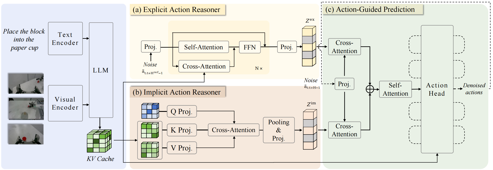

# ACoT-VLA: Action Chain-of-Thought for Vision-Language-Action Models
[](https://arxiv.org/abs/2601.11404)
[](https://huggingface.co/papers/2601.11404)
[](https://creativecommons.org/licenses/by/4.0/)
[](https://opensource.org/licenses/MIT)

This is the **official implementation** of [**ACoT-VLA**](https://arxiv.org/abs/2601.11404), a novel paradigm designed to bridge the fundamental semantic-kinematic gap in modern robotic policies. By shifting the locus of reasoning from perception to action, ACoT-VLA enables robots to "think" in the language of actions.

---

## 🌟 Overview

Existing VLA models often rely on indirect reasoning like sub-task prediction (language) or goal image synthesis (vision), which lack the granular information required for precise execution. We posit that the most effective form of reasoning is one that **deliberates directly in the action space**.

### Key Components:

* **Explicit Action Reasoner (EAR):** A light-weight Transformer that synthesizes coarse-grained motion trajectories to provide direct motion cues.

* **Implicit Action Reasoner (IAR):** Extracts latent action priors from the internal representations of the VLM backbone using cross-attention modeling.

* **Action Chain-of-Thought (ACoT):** Together, EAR and IAR co-form an Action Chain-of-Thought, a reasoning paradigm where the deliberative process is formulated as structured action intents, enabling grounded and long-horizon policy learning.

---

## News 

- 🚀🚀 **The [test server](https://agibot-world.com/challenge2026/reasoning2action/quick-start) of AgiBot World Challenge @ ICRA 2026  is available now.**

- 🔥🔥 The minimal version of training code for [AgiBot World Challenge @ ICRA 2026](https://agibot-world.com/challenge2026) - Reasoning to Action track have been released.

- 🚀🚀 The training datasets of [AgiBot World Challenge @ ICRA 2026 - Reasoning to Action track](https://huggingface.co/datasets/agibot-world/AgiBotWorldChallenge-2026/tree/main/Reasoning2Action-Sim) have been released.

---

## 🏆 ICRA 2026 Baseline (AgiBot World Challenge)

This repository serves as the **official baseline implementation** for the **AgiBot World Challenge @ ICRA 2026**.

The competition configuration can be found at:

* **Config Path**: `src/openpi/training/config.py`
* **Config Name**: `acot_icra_simulation_challenge_reasoning_to_action`

---

## 📊 Performance Benchmarks

ACoT-VLA achieves state-of-the-art performance on multiple simulation benchmarks and exhibits superior robustness under distribution shifts.

### 1. LIBERO Benchmark

ACoT-VLA demonstrates significant improvements, particularly in the **LIBERO-Long** suite, by reducing ambiguity in mapping observations to actions.

| Method | Spatial | Object | Goal | Long | **Avg.** |
| --- | --- | --- | --- | --- | --- |
| $\pi_0$ | 96.8 | 98.8 | 95.8 | 85.2 | 94.1 |
| $\pi_{0.5}$ | 98.8 | 98.2 | 98.0 | 92.4 | 96.9 |
| **ACoT-VLA (Ours)** | **99.4** | **99.6** | **98.8** | **96.0** | **98.5** |
| | | | | | | |
### 2. LIBERO-Plus Robustness Evaluation

ACoT-VLA shows pronounced robustness under challenging perturbations like camera-viewpoint shifts and sensor noise.

| Method | Camera | Robot | Language | Light | Background | Noise | Layout | **Avg.** |
| --- | --- | --- | --- | --- | --- | --- | --- | --- |
| $\pi_0$ | 79.6 | 21.1 | 72.5 | 84.7 | 86.2 | 68.3 | 69.4 | 67.4 |
| $\pi_{0.5}$ | 70.3 | 41.7 | **81.1** | **97.3** | **94.6** | 71.8 | **84.9** | 75.7 |
| **ACoT-VLA (Ours)** | **91.2** | **62.5** | 80.3 | 95.1 | 91.5 | **88.3** | **84.9** | **84.1** |
| | | | | | | | |

### 3. VLABench

Our method delivers substantial gains in unseen-texture tracks and complex tabletop scenarios. Comparison based on **Intention Score (IS)** and **Progress Score (PS)**.

| Methods | In-dist. (IS/PS) | Category (IS/PS) | Commonsense (IS/PS) | Instruction (IS/PS) | Texture (IS/PS) | **Avg. (IS/PS)** |
| --- | --- | --- | --- | --- | --- | --- |
| $\pi_0$ | 67.8 / 62.7 | 44.0 / 33.6 | 54.9 / **43.0** | **58.0** / 38.7 | 50.6 / 42.5 | 55.0 / 44.1 |
| $\pi_{0.5}$ | 75.0 / 60.8 | 49.6 / 35.3 | **57.5** / 41.6 | 57.1 / 30.3 | 62.0 / 47.4 | 60.2 / 43.1 |
| **ACoT-VLA (Ours)** | **79.8 / 66.1** | **54.1 / 38.9** | 52.3 / 37.8 | 56.8 / **39.6** | **74.6 / 54.6** | **63.5 / 47.4** |

---

## 🚀 Get Started

### 1. Installation

We utilize **uv** to manage the Python environment.

```bash
git clone https://github.com/AgibotTech/ACoT-VLA.git
cd ACoT-VLA
git submodule update --init --recursive
GIT_LFS_SKIP_SMUDGE=1 uv sync
GIT_LFS_SKIP_SMUDGE=1 uv pip install -e .

```

### 2. Dataset Preparation

Datasets are processed into the **LeRobot format**.

```bash
python examples/libero/convert_libero_data_to_lerobot.py

```

### 3. Training & Inference

Follow the standardized pipeline to compute normalization statistics and launch training.

```bash
# Compute stats
uv run scripts/compute_norm_stats.py --config-name <CONFIG_NAME>

# Start training
bash scripts/train.sh <CONFIG_NAME> <EXP_NAME>

# Launch policy server
bash scripts/server.sh <GPU_ID> <PORT>

```

---

## 📅 TODO List

* [x] Release core EAR and IAR training modules.
* [x] Release inference code.
* [x] Training configurations for **LIBERO**, **LIBERO-Plus**, and **VLABench**.
* [x] Official baseline for **AGIBot ICRA Simulation Challenge**.
* [ ] Add training configurations for **CALVIN**.
* [ ] Add training configurations for **RoboCasa**.

---

## 📜 Citation

```bibtex
@article{zhong2026acot,
  title={ACoT-VLA: Action Chain-of-Thought for Vision-Language-Action Models},
  author={Zhong, Linqing and Liu, Yi and Wei, Yifei and Xiong, Ziyu and Yao, Maoqing and Liu, Si and Ren, Guanghui},
  journal={arXiv preprint arXiv:2601.11404},
  year={2026}
}

```

## 🙏 Acknowledgements

This repo is built upon the [OpenPI](https://github.com/Physical-Intelligence/openpi) framework. We sincerely thank the authors for their contributions to the community.